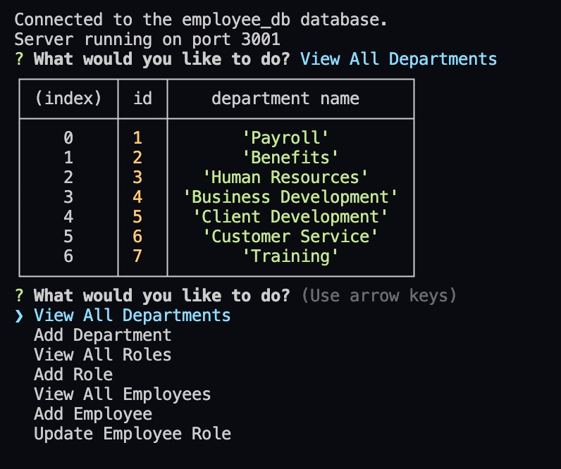

# Employee-Tracker

## Description

This application allows a business owner to view and manage the departments, roles, and employees within their company so they can organize and plan their business. Business owner is able to view and add departments, roles, and employees.

## Table of Contents

- [Getting Started](#getting-started)
- [Visual Example](#visual-example)
- [Future Development](#future-development)
- [Tech Used](#tech-used)
- [License](#license)

## Getting Started

### Prerequisites

- npm
  ```sh
  npm install npm@latest -g
  ```

### Installation

1. Clone the repo
   ```sh
   git clone git@github.com:ZestyLimones/Employee-Tracker.git
   ```
2. Install NPM packages
   ```sh
   npm install
   ```
   <p align="right">(<a href="#top">back to top</a>)</p>

## Visual Example



### Video Demonstraction

Here is a link to the visual demonstration showing the user viewing the departments, roles, and employees, adding a role and employee, and updating an employee's role.

https://drive.google.com/file/d/1HE2j3Nl8a1ftmVJZeCp_W5RAHWF1TrR0/view

   <p align="right">(<a href="#top">back to top</a>)</p>

## Future Development

Right now when a user adds a role they are provided with the department ids. I would like to get it so the user is prompted with the department names so it is easier to navigate.
Right now when a user adds an employee they are provided with the role id and manager id. I would like to get it so the user is prompted with the role name and the managers full name.

   <p align="right">(<a href="#top">back to top</a>)</p>

## Tech Used

<div style='margin: 1em 0;'>


</div>

   <p align="right">(<a href="#top">back to top</a>)</p>

## License

MIT

   <p align="right">(<a href="#top">back to top</a>)</p>
